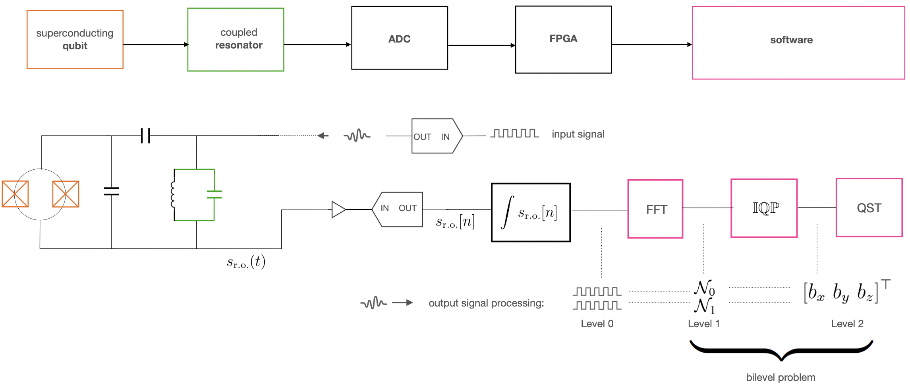

# Bilevel State Tomography

This is a repository companion to the preprint "Quantum State Tomography as a Bilevel Problem" [https://arxiv.org/abs/2108.03448](https://arxiv.org/abs/2108.03448). 

  

The way our illustrations work is as follows. We consider a state ρ (corresponding to a qubit). 

1. File [counts.ipynb](counts.ipynb)
 simulates the process of measuring the three Pauli observables and obtaining counts that will be used to constructed the empirical b vector (see Eq. (3) of the preprint).
2. File [sampling.ipynb](sampling.ipynb) makes the assumptio that the IQ-plane data are obtained by a spherical Gaussian Mixture Models (one GMM for each Pauli observable) and they are sampled according to the counts recorded previously. Doing so, we reconstruct IQ-plane data and then using MLE (also DBSCAN) we decide the membership of each sampled point. This allows us to reconstruct an estimated b vector.
3. We perform "traditional" Quantum State Tomography as an SDP using CVXPY/CVX [...].
4. We perform bilevel Quantum State Tomography [...].
